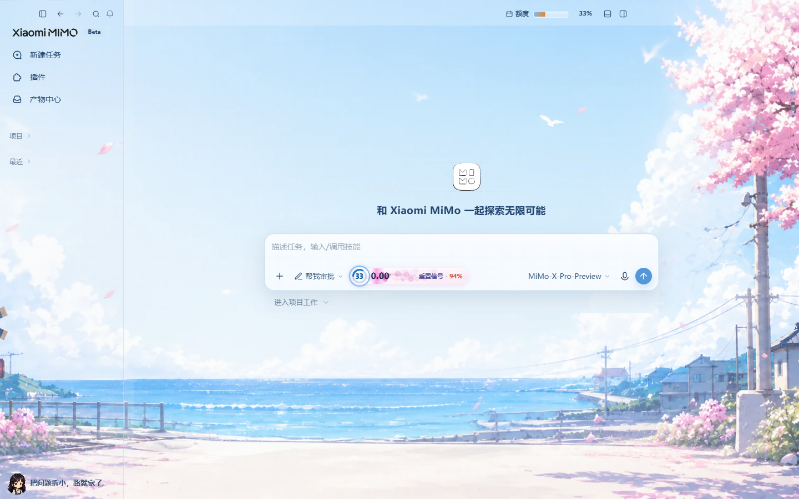
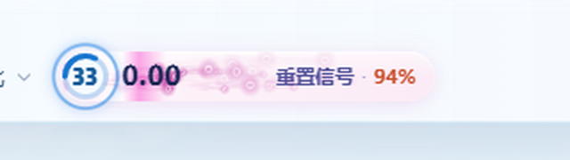
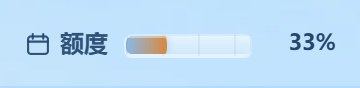

# MiMo Desktop Skin

English | [简体中文](./README.zh-CN.md)

Theme skin for **Xiaomi MiMo Desktop**. Injects CSS over local loopback CDP — does **not** modify the install directory, `app.asar`, or the official signature.

Clone and run: no npm dependencies, no `node_modules`, no local credentials, no Codex-related code.

> Unofficial third-party tool. Confirm client version, asset licenses, and usage boundaries yourself.

## Preview

Sakura Coast skin on a clean **New Task** view (projects collapsed):



Composer progress bar (remaining quota ring · today amount · public X reset signal):



Header quota pill:



## Requirements

- Windows 10+
- Xiaomi MiMo Desktop installed
- Node.js 22+ on `PATH`

## Quick start

```powershell
git clone https://github.com/MeilunCsl/MIMo-Desktop-Skin.git
cd MIMo-Desktop-Skin

# Install desktop / Start Menu shortcuts (once)
powershell -NoProfile -ExecutionPolicy Bypass -File .\mimo\scripts\install-launch-shortcuts.ps1

# Double-click the desktop shortcut "MiMo 皮肤"
# Or from the command line (ensures the shortcut exists, then prompts you to launch MiMo from it)
powershell -NoProfile -ExecutionPolicy RemoteSigned -File .\Start-MiMo.ps1
```

Common commands:

```powershell
powershell -NoProfile -ExecutionPolicy RemoteSigned -File .\Start-MiMo.ps1 -List
powershell -NoProfile -ExecutionPolicy RemoteSigned -File .\Start-MiMo.ps1 -Diagnose
powershell -NoProfile -ExecutionPolicy RemoteSigned -File .\Start-MiMo.ps1 -Revert
powershell -NoProfile -ExecutionPolicy RemoteSigned -File .\Start-MiMo.ps1 -Verify

# Injector (MiMo must already run with the debug port)
node .\mimo\scripts\inject-skin.mjs --list
node .\mimo\scripts\inject-skin.mjs --theme sakura-coast
node .\mimo\scripts\inject-skin.mjs --revert
```

## Skin

One built-in theme:

| id | Name |
|---|---|
| `sakura-coast` | Sakura Coast |

To change artwork: replace `mimo/assets/sakura-coast.webp`, or edit `image` / `colors` / `glass` in `mimo/assets/themes/sakura-coast.json`.

## Why launch from the shortcut

MiMo is a single-instance Electron app. If started from a terminal, closing that console can take the child process down.  
The shortcut is started by Explorer, so its parent is `explorer.exe` and is unrelated to any terminal.

If MiMo is already running (including tray), double-clicking again hits the single-instance lock and the window flashes and exits — fully quit MiMo from the tray first.

## What the “reset signal” is

The signal next to the header / composer **only reads the public X (Twitter) timeline** (`https://x.com/thsottiaux`) for posts about quota resets, then classifies them locally.

- Not an official notification
- Does not read cookies / tokens / account credentials
- On network failure it stays empty; theming still works

See `mimo/scripts/tibo-radar.mjs`.

## Layout

```text
Start-MiMo.ps1                      # root entry
mimo/Start-MiMo-Skin.ps1            # locate exe, shortcuts, CDP, call injector
mimo/scripts/inject-skin.mjs        # CDP inject + runtime
mimo/scripts/theme-css.mjs          # semantic colors → MiMo tokens
mimo/scripts/tibo-radar.mjs         # public X feed (optional signal)
mimo/scripts/install-launch-shortcuts.ps1
mimo/assets/themes/sakura-coast.json
mimo/assets/sakura-coast.webp
mimo/assets/side-avatar.webp
mimo/selectors.json                 # selector contract
logo/mimo.ico                       # fallback shortcut icon (prefers installed MiMo app icon)
```

## Security

- No API keys, cookies, tokens, personal config, or machine-specific absolute paths in the repo
- Runtime state only under `%LOCALAPPDATA%\MiMoDreamSkin`
- CDP binds to `127.0.0.1` only
- Does not read local API credential files in the app userData
- Does not upload chat content or modify install files

## Clone self-check

```powershell
node .\mimo\scripts\inject-skin.mjs --list
```

Should print `sakura-coast`.
