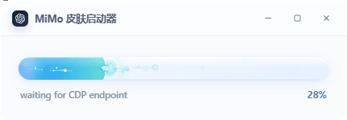

# MiMo Desktop Skin

English | [简体中文](./README.zh-CN.md)

Theme skin for **Xiaomi MiMo Desktop**. Injects CSS over local loopback CDP — does **not** modify the install directory, `app.asar`, or the official signature.

Clone and run: no npm dependencies, no `node_modules`, no local credentials, no Codex-related code.

> Unofficial third-party tool. Confirm client version, asset licenses, and usage boundaries yourself.

## Preview

Product site (bilingual): open [`site/index.html`](./site/index.html) in a browser.

Sakura Coast on a clean **New Task** view (projects collapsed):


Launcher window (real capture — progress follows worker `PROGRESS` stages):



## Requirements

- Windows 10+
- Xiaomi MiMo Desktop installed
- Node.js 22+ on `PATH`

## Quick start

```powershell
git clone https://github.com/MeilunCsl/MIMo-Desktop-Skin.git
cd MIMo-Desktop-Skin

# Desktop / Start Menu shortcut (once)
powershell -NoProfile -ExecutionPolicy Bypass -File .\mimo\scripts\install-launch-shortcuts.ps1

# Show the launcher window (progress bar follows real stages)
powershell -NoProfile -STA -ExecutionPolicy Bypass -File .\Start-MiMo.ps1
```

Common commands:

```powershell
powershell -NoProfile -ExecutionPolicy RemoteSigned -File .\Start-MiMo.ps1 -List
powershell -NoProfile -ExecutionPolicy RemoteSigned -File .\Start-MiMo.ps1 -Diagnose
powershell -NoProfile -ExecutionPolicy RemoteSigned -File .\Start-MiMo.ps1 -Revert
powershell -NoProfile -ExecutionPolicy RemoteSigned -File .\Start-MiMo.ps1 -Verify
powershell -NoProfile -ExecutionPolicy RemoteSigned -File .\Start-MiMo.ps1 -NoLauncher -Theme sakura-coast

# Injector (MiMo must already run with the debug port)
node .\mimo\scripts\inject-skin.mjs --list
node .\mimo\scripts\inject-skin.mjs --theme sakura-coast
node .\mimo\scripts\inject-skin.mjs --revert
```

## Skin

One built-in theme: **`sakura-coast`** (Sakura Coast).

To change artwork: replace `mimo/assets/sakura-coast.webp`, or edit `image` / `colors` / `glass` in `mimo/assets/themes/sakura-coast.json`.

## Launcher progress (real stages)

The desktop launcher does **not** run a timed fake bar. The worker prints machine-readable marks:

```text
PROGRESS <0-100> <stage>
```

| Stage | Percent | Source |
|---|---|---|
| Locate MiMo process | 8% | `Start-MiMo-Skin.ps1` |
| Launch / restart MiMo | 18% | `Start-MiMo-Skin.ps1` |
| Wait for CDP endpoint | 28–40% | `Start-MiMo-Skin.ps1` |
| Renderer ready | 55% | `Start-MiMo-Skin.ps1` |
| Connect CDP / attach | 60–65% | `inject-skin.mjs` |
| Compose theme CSS | 72–84% | `inject-skin.mjs` |
| Inject stylesheet | 91% | `inject-skin.mjs` |
| Apply runtime | 94% | `inject-skin.mjs` |
| **Success (verified)** | **100%** | worker exit code 0 |

`Launcher.cs` parses these lines and updates the UI. 100% is reserved for a successful inject.

## Why launch from the shortcut

MiMo is a single-instance Electron app. Starting it from a terminal can take the child process down when that console closes.  
The shortcut is started by Explorer (`explorer.exe` parent). If MiMo is already running (including tray), fully quit it first.

## What the “reset signal” is

The composer signal **only reads the public X timeline** (`https://x.com/thsottiaux`) for quota-reset posts, then classifies them locally.

- Not an official notification
- No cookies / tokens / account credentials
- Network failure leaves it empty; theming still works

See `mimo/scripts/tibo-radar.mjs`.

## Layout

```text
Start-MiMo.ps1                      # root entry (launcher by default)
Start-Codex.ps1                     # WebView2 progress launcher host
mimo/Start-MiMo-Skin.ps1            # locate exe, shortcuts, CDP, inject
mimo/scripts/inject-skin.mjs        # CDP inject + runtime (+ PROGRESS marks)
mimo/scripts/theme-css.mjs          # semantic colors → MiMo tokens
mimo/scripts/tibo-radar.mjs         # public X feed (optional signal)
mimo/scripts/install-launch-shortcuts.ps1
mimo/assets/themes/sakura-coast.json
mimo/assets/sakura-coast.webp
mimo/assets/side-avatar.webp
mimo/selectors.json
windows/launcher/                   # optional WebView2 host (SDK DLLs not in Git)
docs/images/                        # README screenshots / GIF
site/                               # bilingual product page
logo/mimo.ico
```

> Animated launcher needs WebView2 SDK assemblies under `windows/launcher/lib/` (not published in this repo). Without them the launcher falls back to a non-WebUI path.

## Security

- No API keys, cookies, tokens, personal config, or machine-specific absolute paths
- Runtime state only under `%LOCALAPPDATA%\MiMoDreamSkin`
- CDP binds to `127.0.0.1` only
- Does not read local API credential files in the app userData
- Does not upload chat content or modify install files

## Clone self-check

```powershell
node .\mimo\scripts\inject-skin.mjs --list
```

Should print `sakura-coast`.
